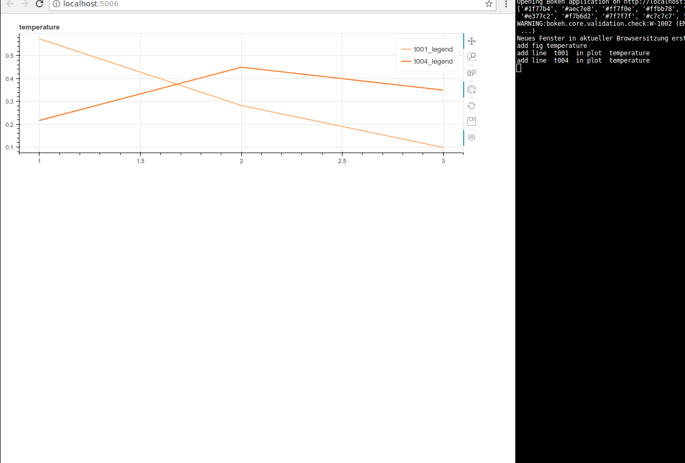

# dynamic_live_plot
*Dynamic Live Plot* is a simple way to plot data live and nonblocking. It is capable of dynamically adding and removing plots and graph glyphs during runtime. This is especially useful, if you do not know, which data will occour during runtime. This might be the case in a sensornetwork, where nodes may emerge, or disappear.

Its usage is extremely simplyfied. By calling just one method, plots can be updated by new data. Inbetween these updates of the plots, blocking computation can be done without stopping the live plot from working.



The software depends on Python Bokeh. It strongly utilizes features of Bokeh like its server or "next tick callbacks". Its main class basically is an abstraction of [embedding Bokeh Server as a library](https://bokeh.pydata.org/en/latest/docs/user_guide/server.html#embedding-bokeh-server-as-a-library) (also see the [standalone_embed.py](https://github.com/bokeh/bokeh/tree/0.12.16/examples/howto/server_embed/standalone_embed.py)). To make the update calls non-blocking it extends *threading.Thread*.

## Usage
The only class method is *push_d()*. Its purpose is to tell *BokehLivePlot* which data to plot. It accepts a nested dictionary as an argument:
* Outer dictionary: Figures to plot
* Inner dictionary: Lines of data, represented by numpy arrays (which is recommended by Python Bokeh)
Following example shows the usage of the class BokehLivePlot.
```python
# import bokeh_live_plot
from bokeh_live_plot import BokehLivePlot
import time
# create BokehLivePlot object
myplot = BokehLivePlot()
# inject data for plotting
myplot.push_d(dict(FirstPlot=dict(plotA=np.array([0.1, 0.2, 0.3]), plotb=np.array([0.2, 0.3, 0.4]))
# do blocking computation (maybe for data acquisition)
time.sleep(.2)
# inject further data for plotting 
myplot.push_d(dict("FirstPlot"=dict("plotA=np.array([0.3, 0.2, 0.1]), plotb=np.array([0.4, 0.2, 0.3]))
```

## Requirements
BokehLivePlot strongly depends on Python [Bokeh](https://bokeh.pydata.org/en/latest/), which is licensed under BSD 3-Clause.

## Quick test
Clone (or download, if desired) the repository:
```console
git clone https://github.com/ticktronaut/dynamic_live_plot.git
```
Go to the directory, that contains the code:
```console
cd bokeh
```
Launch the sample script (tested on Python 3.6):
```console
python blp_sample.py
```
